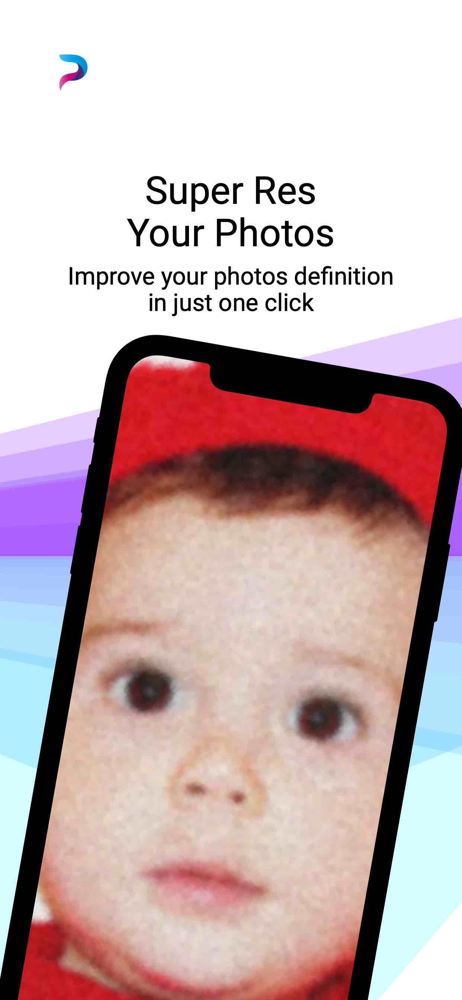
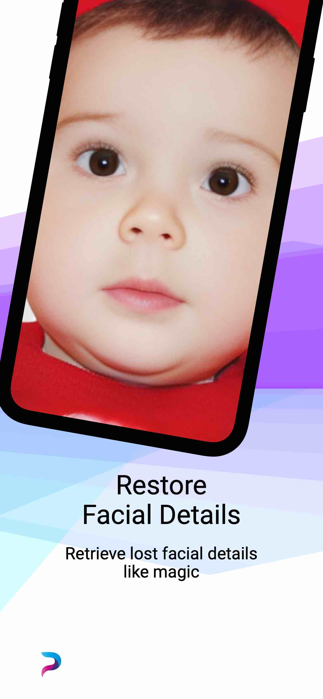
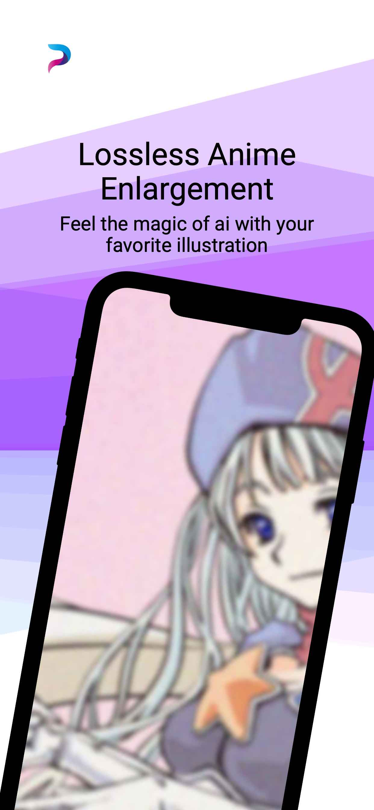
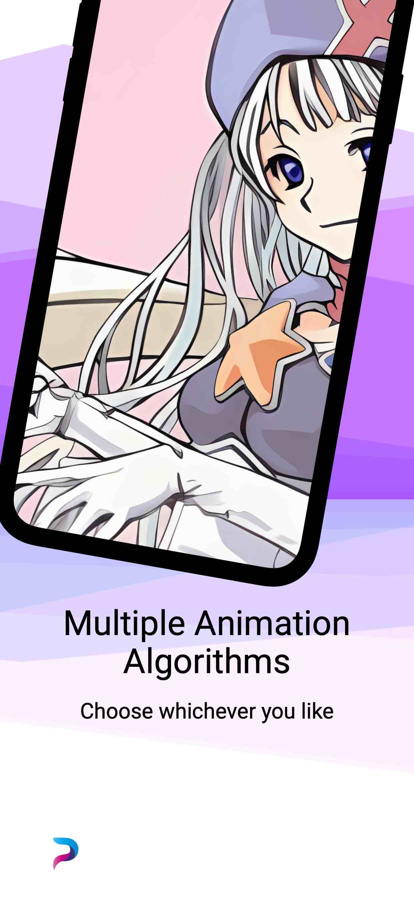
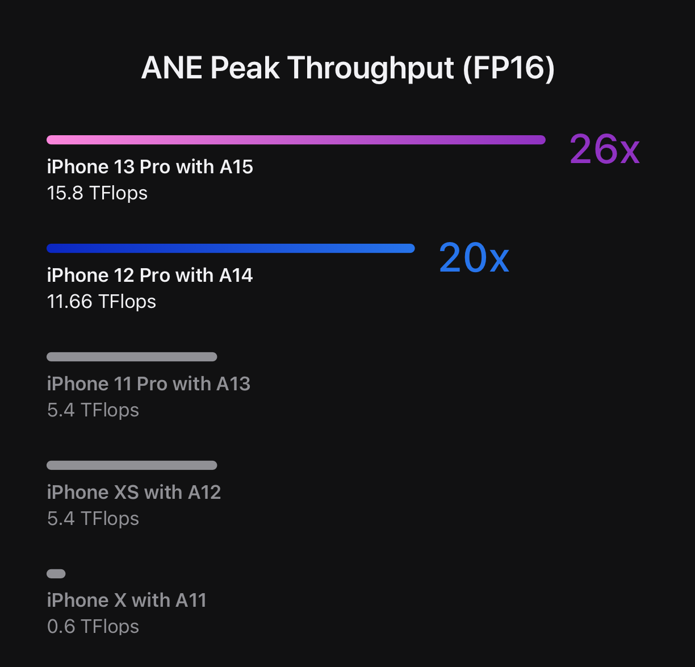

# PixAI-Manual
Manual for PixAI iOS Super Resolution App

## What is this app for ?
PixAI is a software built for iOS device that focuses on using AI algorithm to improve image definition. It can easily enlarge low resolution images by 16X.   

   

## Where can I get this app ?
You can install it on **iPhone, iPad, and MacBook with Apple Silicon**.   
   
[Download on AppStore](https://apps.apple.com/us/app/pixai/id6443815029)  

Minimum configuration requirements:   
1. Apple A12 chip
2. iOS 15.0 +   
Note: **On iOS15, model cannot be guaranteed to run on ANE. It may consume more power and memory, and reduce processing speed.**

Recommended configuration:   
1. iOS 16.0 +
2. Apple chip with faster Neural Engine   

   
For reference, the ANE on chip A15 has the FP16 processing capacity of 15.8TFLOPS, which is the same level as RTX 3060Ti

## Key Features
- Photo Super Resolution
- Anime Super Resolution
- Face Super Resolution
- Old Photo Colorization
- Low Light Enhancement   

## Is my iPhone powerful enough for this AI models ?
Generally speaking, **YES**.   
I spent a lot of time to optimize the running speed of the model. On iOS16, except for the facial super resolution and coloring models, other models will run on the Apple Neural Engine. This will result in satisfactory performance.
## Is this app free or not ?
You can download and test any function of PixAI for free. But if you want to export the picture, there will be a one-time payment of $6.99.
## Awesome AI Models Behind the Scenes and their LICENSES
- Photo Super Resolution
  - [RealESRGAN](https://github.com/xinntao/Real-ESRGAN)
  - [A-ESRGAN](https://github.com/stroking-fishes-ml-corp/A-ESRGAN)
  - [MM-RealSR](https://github.com/TencentARC/MM-RealSR)
- Anime Super Resolution
  - [RealESRGAN-Anime](https://github.com/xinntao/Real-ESRGAN/blob/master/docs/model_zoo.md)
  - [RealCUGAN(Pro)](https://github.com/bilibili/ailab/tree/main/Real-CUGAN)
- Face Super Resolution
  - [GFPGAN](https://github.com/TencentARC/GFPGAN)
- Old Photo Colorization
  - [DeOldify](https://github.com/jantic/DeOldify)
- Low Light Enhancement
  - [ZeroDCE](https://keras.io/examples/vision/zero_dce/)
- Others
  - I used [john-rocky convert scripts](https://github.com/john-rocky/CoreML-Models#anime2sketch) for A-ESRGAN and MM-RealSR conversion.

